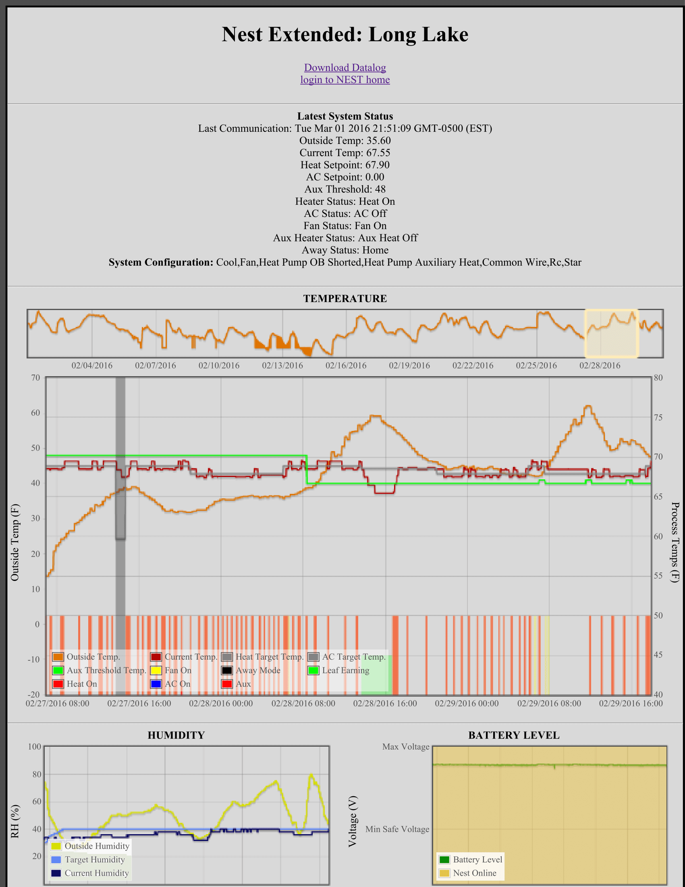
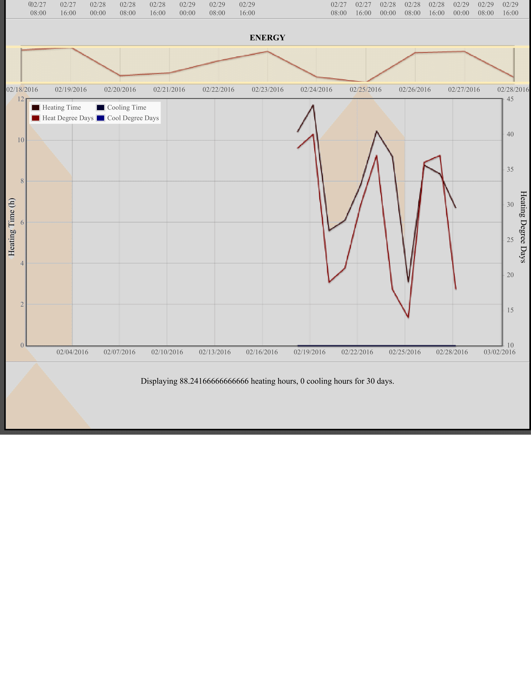

=============

Introduction
-------------
This is an expansion of Nest Extended, by Matt Hirschfelt, and relies on the same projects.

<a href="https://github.com/MattHirschfelt/Nest-Extended">Nest Extended</a>

The purpose of this project is to datalog from the Nest Thermostat, as well as provide some options (such as active humidity control or circulation mode) that expand on the Nest capabilities. 

Additions/Changes in Nest Datalog:
- The data has been reformatted to be easier to read. In addition, this version now relies on the Flot "Labels" library by Matt Burland in order to provide axis labes and units. 
- I have added support for heat pumps and system configuration. Nest Datalog now reports Aux/Regular heat, Aux threhsold temperatures and system level configuration. The last measurement is displayed at the top of the page for easy reading. This also requires modifying the NEST PHP API.
- A data filtering algorithm has been added that discards nonsense values that are often returned by the nest call. This improves the continuity of the data. 
- The degree day algorithm has been changed to get data for multiple days. This improves the robustness of the algorithm and helps prevent gaps in the data. 
- All changes have been commented to allow for easier modifications in the future
- Circulation mode has been added for users with wood stoves. This detects when the stove is active, and periodically turns on the fan to circulate warm air through the house.

Installation
-------------
This requires a webserver running MySQL and PHP. I use a LAMP  (Linux, Apache, MySQL and PHP) server running Linux Mint. 

1) Make sure you have a working server. A good guide for a LAMP server is here: <ahref="https://community.linuxmint.com/tutorial/view/486">Setting up a LAMP server</a> 
2) Once you have verified that PHP and MySQL are installed, copy the files from this project into the root directory of your web server. For Linux, /var/www/ is the usual directory.
3)Install PHPmyAdmin. This makes managing the MySQL server much easier. 
4) Create a new MySQL database on your server called "Nest." Using PHPMyAdmin, you can import the structure from the 'matth41_nestdb.sql' file in the resources folder.
5) install curl from the command line. This enables command line querying of websites. 
6)Edit the config.php in the resources folder to provide the credentials for your Nest account, your MySQL database, your Weather Underground API, set your time zone, and whether you want to try and control your humidity level/ circulation mode. You can sign up for a Weather Underground API key at http://www.wunderground.com/weather/api/?apiref=c133a2be0b541640
7) install gnome-schedule for easy CRON scheduling. Create a cron job for nest-get-data.php?datatype=current to run at a regular interval. Use curl http://localhost/resources/utils/nest-get-data.php?datatype=current.
8) Create a cron job for nest-get-data.php?datatype=daily to run once per day. The first time this runs, it should populate 9 days of data. As before, use curl. 

Enjoy the datalogging capabilities!

Example Screenshot:
+
 +
